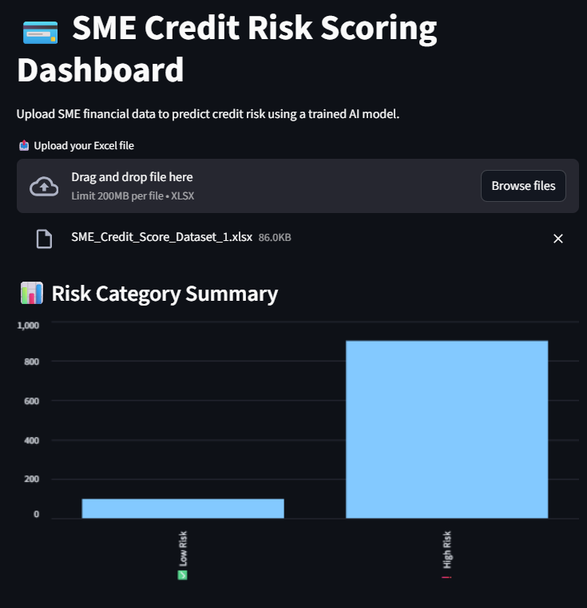
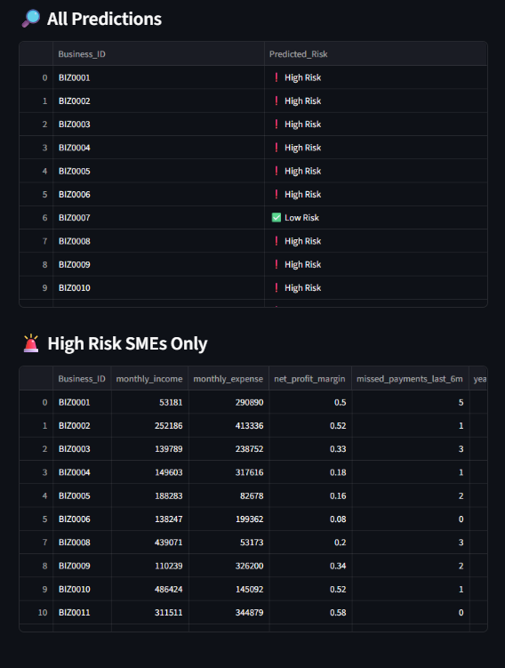

# 💳 SME Credit Risk Scoring Dashboard

An AI-powered credit risk scoring dashboard designed for **small and medium-sized enterprises (SMEs)**. This Streamlit app enables banks, fintech companies, and lenders to assess the risk level of SMEs using key financial and behavioral indicators.

🔗 **Live App**: [http://bit.ly/45EmzRz](http://bit.ly/45EmzRz)  
📦 **Model**: Trained using XGBoost on synthetic SME financial data  
📊 **Dashboard**: Built with Streamlit + Python  
📁 **Status**: MVP complete, ready for further integration or API deployment

---

## 📌 Table of Contents

- [🎯 Problem Statement](#-problem-statement)
- [🚀 Project Objectives](#-project-objectives)
- [📊 Features](#-features)
- [🧠 Model Details](#-model-details)
- [🧾 Dataset Description](#-dataset-description)
- [💻 How to Run This App](#-how-to-run-this-app)
- [📸 Preview](#-preview)
- [🛠 Tech Stack](#-tech-stack)
- [🧑‍💼 Use Cases](#-use-cases)
- [📈 Future Enhancements](#-future-enhancements)
- [📬 Contact](#-contact)

---

## 🎯 Problem Statement

Traditional credit scoring systems struggle with evaluating **SMEs**, especially those without a long credit history ("thin file" problem). Many lenders rely on manual assessments, which are slow, inconsistent, and not scalable.

---

## 🚀 Project Objectives

- Simulate a realistic SME financial dataset
- Train a machine learning model to predict SME credit risk
- Build an interactive web dashboard for:
  - Uploading SME data
  - Predicting risk categories
  - Visualizing risk summaries
- Make the app accessible online via Streamlit Cloud

---

## 📊 Features

- 🧾 Upload SME financial data (Excel `.xlsx`)
- 🤖 Predict SME risk as `✅ Low Risk` or `❗ High Risk`
- 📊 Visualize overall risk distribution with dynamic bar chart
- 🔎 Filter and review high-risk SMEs in a clean table
- 📁 Downloadable and easy to integrate into further workflows

---

## 🧠 Model Details

- Algorithm: `XGBoost Classifier`
- Target Variable: `risk_label` (0 = Low Risk, 1 = High Risk)
- Performance:
  - Accuracy: **99.5%**
  - Precision/Recall: Excellent recall for high-risk class
- Model saved using `joblib` for deployment in Streamlit

---

## 🧾 Dataset Description

Synthetic dataset of **1,000 SME records** with the following fields:

| Column                     | Description |
|----------------------------|-------------|
| `monthly_income`           | Monthly revenue in INR |
| `monthly_expense`          | Total operating cost |
| `net_profit_margin`        | Profit as a % of income |
| `missed_payments_last_6m`  | Count of late utility/invoice payments |
| `years_in_business`        | Business age |
| `vendor_concentration_ratio` | Risk of supply chain dependency |
| `invoice_paid_on_time_rate` | Reliability score |
| `loan_amount_requested`    | Requested loan size |
| `revenue_growth_rate`      | Recent trend in revenue |
| `risk_label`               | Actual credit risk (simulated) |
| ➕ Engineered features: `profit_amount`, `debt_to_income_ratio`, `cash_flow_stability`

---

## 💻 How to Run This App Locally

### 1. Clone the repository:

```bash
git clone https://github.com/R-Krishnakumar94/sme-credit-risk-dashboard.git
cd sme-credit-risk-dashboard
```

### 2. Install dependencies:

```bash
pip install -r requirements.txt
```

### 3. Run the Streamlit app:

```bash
streamlit run credit_app.py
```

Make sure the model file `xgb_credit_model.pkl` is in the same folder.

---

## 📸 Preview





---

## 🛠 Tech Stack

- Python 3.x
- Streamlit
- XGBoost
- Pandas, NumPy
- scikit-learn
- joblib
- Excel (`.xlsx`) as input

---

## 🧑‍💼 Use Cases

- Credit assessment for MSMEs by banks or NBFCs
- Fintech loan approval platforms
- Government-backed microfinance scoring tools
- Financial inclusion analytics
- Risk-as-a-Service prototype for small business lending

---

## 📈 Future Enhancements

- ✅ SHAP-based explainability (why a business is risky)
- ✅ PDF report generator per SME
- ✅ Upload multiple files / batch processing
- ✅ API deployment using FastAPI
- ✅ Authentication for secured use

---

## 📬 Contact

**Rakesh Krishna Kumar**  
📧 rakesh.krishee@gmail.com  
🔗 [LinkedIn](https://www.linkedin.com/in/rakesh-krishna-kumar)  
💼 [GitHub](https://github.com/R-Krishnakumar94)
